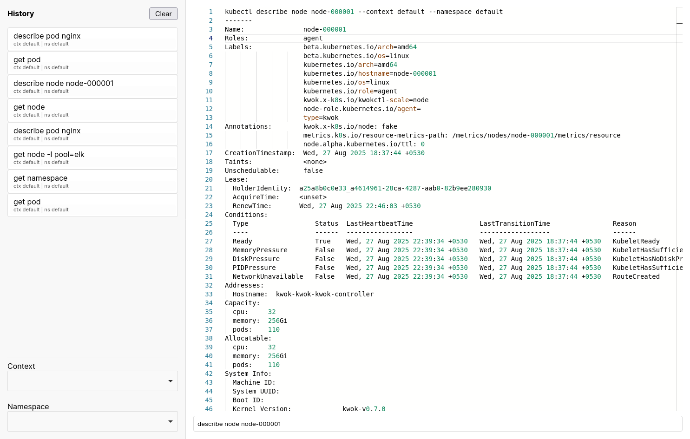

# k8s-webui

A simple web-based UI for interacting with Kubernetes clusters.
This project provides a split-pane interface for running kubectl commands,
viewing command history, and switching between contexts and namespaces.

## Features

- Run Kubernetes commands from the browser
- View output in real time in VS Code web editor
- Command history with easy re-run
- Switch between multiple contexts and namespaces
